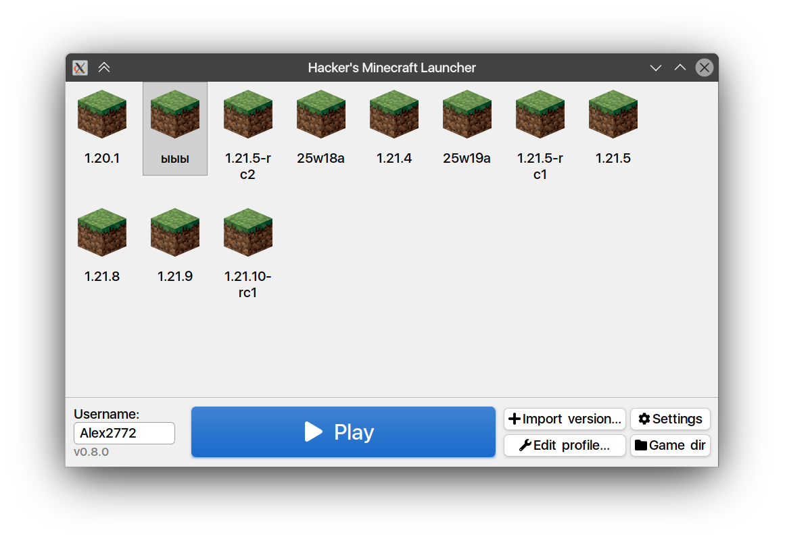

# Hacker's Minecraft Launcher



A fast, cross-platform, open-source launcher for Minecraft with a focus on a clean UI/UX and reliable mod/profile management.

## Features
- Cross-platform builds (CMake-based)
- Modpack and mod handling
- Offline-friendly caching

## Platforms

- Windows
- Linux

## Prerequisites
- CMake (3.20+ recommended)
- A C++ compiler with C++20 support (e.g., GCC 11+, Clang 13+, MSVC 19.3+)
- Ninja or Make (optional but recommended)
- Git

## Quick Start (Local Build)

```bash
mkdir build
cd build
cmake ..
cmake --build .
```

